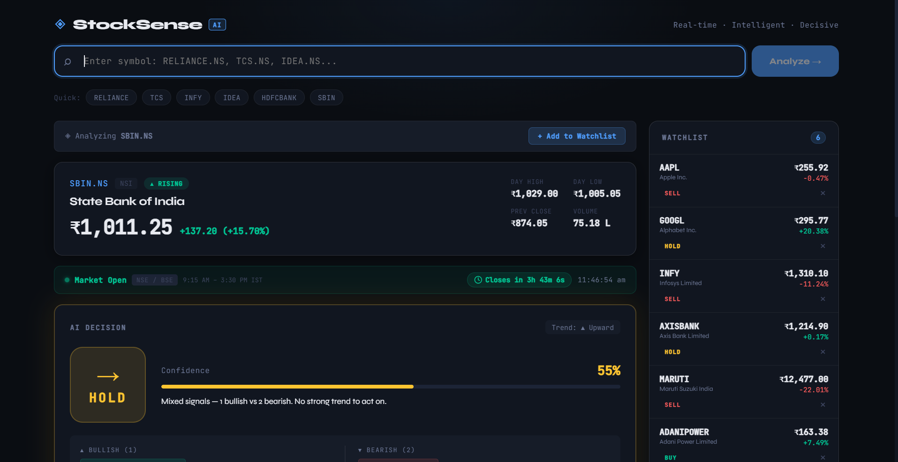
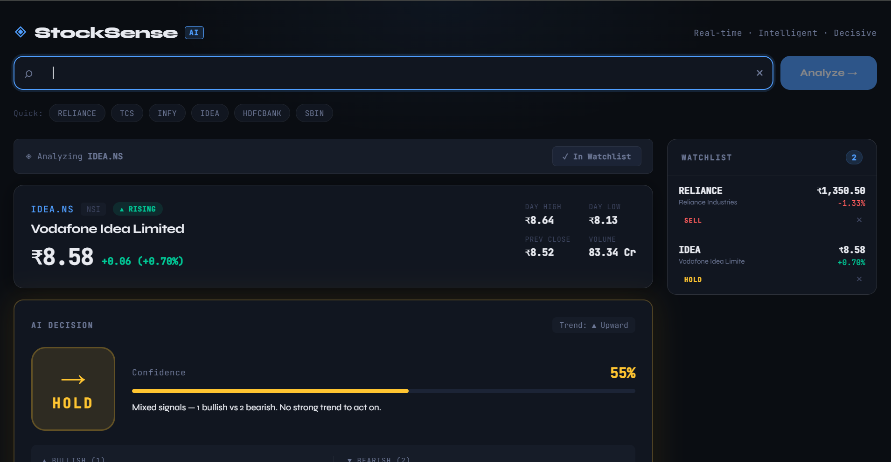
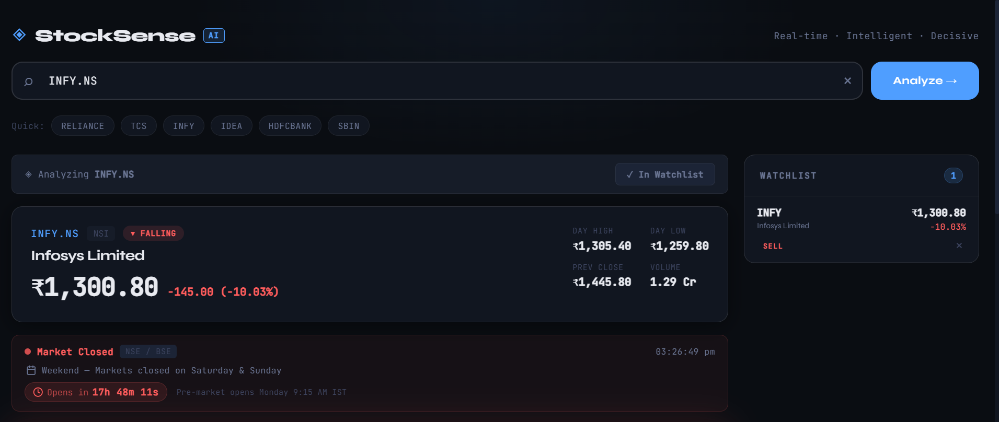
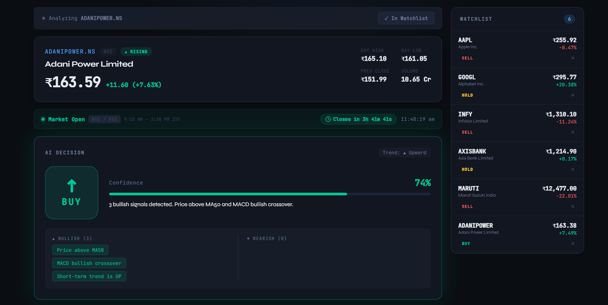
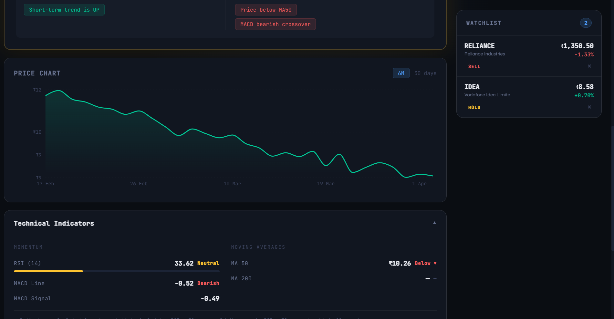
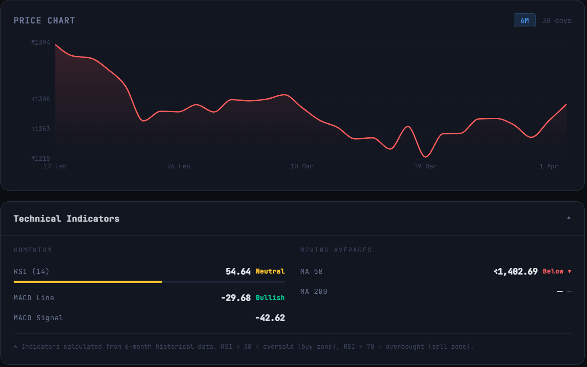
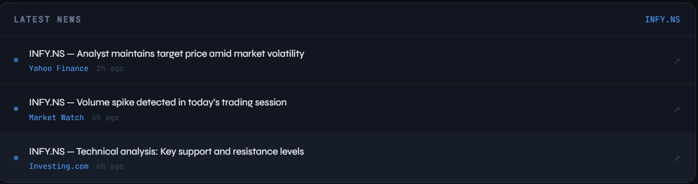

# 📈 StockSense — AI Smart Stock Advisor

🚀 AI-powered full-stack stock analysis platform that provides **BUY / SELL / HOLD recommendations** using real-time data and technical indicators.

🔗 **Live Demo:** https://stock-sense-rho-three.vercel.app/

---


---

## 📁 Folder Structure

```
stock-advisor/
├── package.json               ← Root scripts (run both servers)
│
├── backend/
│   ├── package.json
│   ├── server.js              ← Express API + Yahoo Finance + Decision Logic
│   └── .env                   ← PORT config
│
└── frontend/
    ├── package.json
    ├── vite.config.js         ← Proxy /api → localhost:5000
    ├── index.html
    └── src/
        ├── main.jsx
        ├── App.jsx            ← Root layout + state
        ├── index.css          ← Design system (CSS variables)
        ├── responsive.css     ← Mobile breakpoints
        ├── utils/
        │   └── api.js         ← Axios instance
        ├── hooks/
        │   └── useWatchlist.js ← localStorage watchlist
        └── components/
            ├── SearchBar.jsx      ← Top search + quick picks
            ├── StockOverview.jsx  ← Price card
            ├── DecisionCard.jsx   ← BUY/SELL/HOLD + confidence
            ├── PriceChart.jsx     ← Recharts area chart
            ├── DetailsSection.jsx ← Collapsible RSI/MACD/MA
            ├── Watchlist.jsx      ← Sidebar with saved stocks
            ├── NewsSection.jsx    ← Latest headlines
            └── States.jsx         ← Loading + Error states
```

---

## ⚡ Setup in VS Code — Step by Step

### Prerequisites
- [Node.js 18+](https://nodejs.org/) installed
- VS Code with a terminal

---

### Step 1 — Open the project

```bash
# In VS Code, open the stock-advisor folder
# Then open the integrated terminal (Ctrl+` or Cmd+`)
```

---

### Step 2 — Install backend dependencies

```bash
cd backend
npm install
```

---

### Step 3 — Install frontend dependencies

```bash
cd ../frontend
npm install
```

---

### Step 4 — Start the backend server

Open a **new terminal** in VS Code:

```bash
cd backend
npm run dev
```

You should see:
```
✅ Stock Advisor API running on port 5000
```

---

### Step 5 — Start the frontend

Open another **new terminal**:

```bash
cd frontend
npm run dev
```

You should see:
```
  VITE v5.x  ready in xxx ms
  ➜  Local:   http://localhost:3000/
```

---

### Step 6 — Open the app

Visit **http://localhost:3000** in your browser.

---

## 🚀 One-Command Start (Optional)

From the **root** `stock-advisor/` folder:

```bash
npm install          # installs concurrently
npm run install:all  # installs backend + frontend deps
npm run dev          # starts both servers simultaneously
```

---

## 📈 How to Use

| Action | How |
|--------|-----|
| Search NSE stock | Type `RELIANCE.NS` → Analyze |
| Search BSE stock | Type `RELIANCE.BSE` |
| Search US stock | Type `AAPL`, `TSLA`, `GOOGL` |
| Quick pick | Click a chip below the search bar |
| Add to watchlist | Click "+ Add to Watchlist" after analyzing |
| Re-analyze from watchlist | Click any watchlist item |
| View technical details | Click "Technical Indicators" toggle |

---

## 🧠 Decision Logic

```
Bullish signals:  price > MA50, price > MA200, MACD > signal, RSI < 30, trend up
Bearish signals:  price < MA50, price < MA200, MACD < signal, RSI > 70, trend down

Priority rule:    trend == "down" AND price < MA50  →  SELL (overrides)
bearish >= 3   →  SELL
bullish >= 3   →  BUY
else           →  HOLD
```

---

## 🔌 API Endpoints

| Method | Endpoint | Description |
|--------|----------|-------------|
| GET | `/api/stock/:symbol` | Full analysis: price, indicators, decision, chart |
| GET | `/api/news/:symbol` | Latest news headlines |
| GET | `/api/health` | Server health check |

---

## 🛠 Tech Stack

| Layer | Tech |
|-------|------|
| Frontend | React 18, Vite, Recharts |
| Backend | Node.js, Express |
| HTTP Client | Axios |
| Data Source | Yahoo Finance (free, no API key needed) |
| Persistence | localStorage (watchlist) |
| Fonts | Syne + JetBrains Mono |

---

## ⚠️ Disclaimer

This app is for **educational purposes only**.  
It does not constitute financial advice. Always do your own research before investing.

---
## 📸 Screenshots

### 🏠 Dashboard



### 🤖 AI Decision - HOLD



### 📉 AI Decision - SELL



### 📈 AI Decision - BUY



### 📊 Price Chart



### 📐 Technical Indicators



### 📰 Latest News




## 🐞 Troubleshooting

**`CORS error` in browser console**
→ Make sure backend is running on port 5000

**`Symbol not found`**
→ Try `.NS` suffix for NSE: `INFY.NS`, `TCS.NS`

**`Insufficient price data`**
→ Some small-cap symbols may have limited history

**`Network Error`**
→ Yahoo Finance occasionally rate-limits. Wait 30s and retry.
